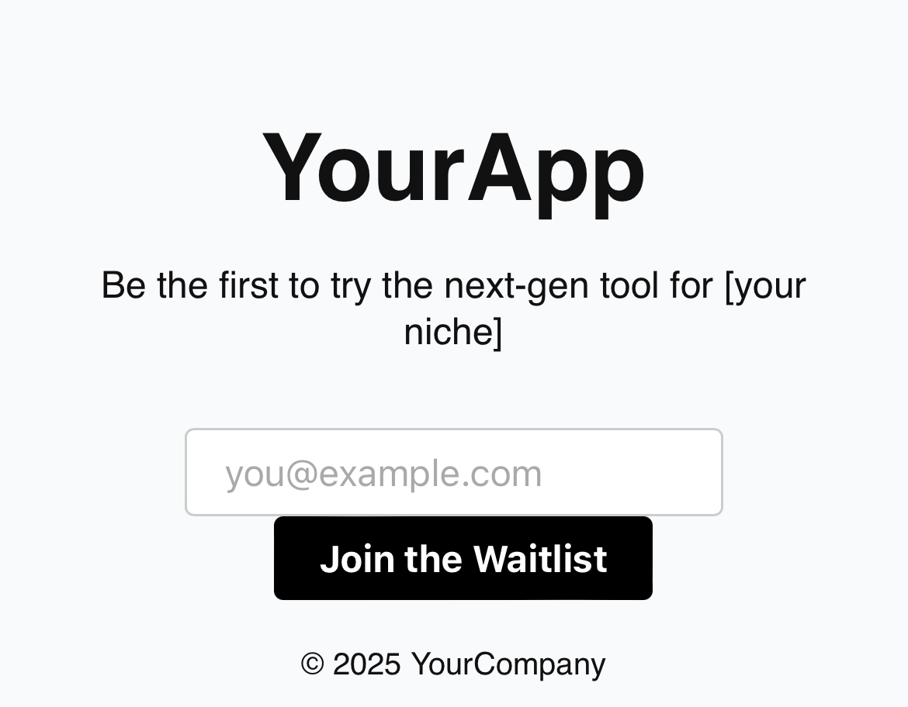

# 🛫 Landing Page Template
 

A basic but beautiful static landing page to collect waitlist signups. No backend needed. Perfect for founders, makers, and indie hackers.

## 💡 Features
- Clean HTML/CSS layout
- Email input with JavaScript response
- Deployable anywhere (Netlify, Vercel, GitHub Pages)

## 🚀 How to use
1. Clone or fork the repo
2. Edit `index.html` with your app’s name and tagline
3. Deploy via Netlify, Vercel, or any static host

## 📝 License
MIT — use freely!

---
Built  by [@ne0c0der](https://github.com/ne0c0der)
---

### 📫 Stay Connected

[🐦 Twitter](https://twitter.com/ne0c0der) • [💻 GitHub](https://github.com/ne0c0der) • [💬 Discord](https://discord.gg/MU82kkA7) • [✉️ Email](mailto:support@temporalaitechnologies.com)

 

© 2025 **Temporal AI Technologies Inc.** — All rights reserved.
